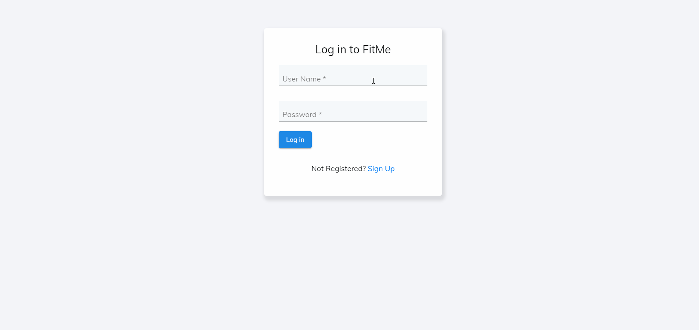

# FitMe Full-stack Application
FitMe is a full-stack Fitness Application that creates personalized diet plans for users, and allows users to track their fitness data.

## Demo and Features

### Features
* RESTful back-end server allowing user fitness data to be stored persistently in a MongoDB cloud database
* Reactive front-end design using Angular 8
* Fully functional user authentication using JWT
* Live updating graphs and charts using ngx-charts and mat-table
* Automated test coverage using jest.js

### Login demo


### Dashboard demo


### Live updating table demo


## Getting Started

These instructions will get you a copy of the project up and running on your local machine for development and testing purposes.

### Prerequisites

This project was built using Angular 8, NodeJS v12.3.1 and MongoDB. All dependencies can be found in the package.json file. See below to install all dependencies.

### Installing

Install the dependencies in the package.json file

```
In the project folder, run: $ npm i
```

### Running the Application

After all the dependencies are installed, follow the below commands to run the application.

```
Startup MongoDB locally, run: $ mongod 
```

```
Startup back-end server, run: $ nodemon server 
```

```
Startup front-end application, run: $ ng serve
```

## Running the tests

Back-end tests are written using the JEST package.

```
To run the tests: $ npm test
```

## Deployment

This application comes prepared to deploy to production. Please note that a MongoDB cloud database is required for production. 

## Authors

* **Omar Shaban**

## License

This project is licensed under the MIT License - see the LICENSE.md file for details